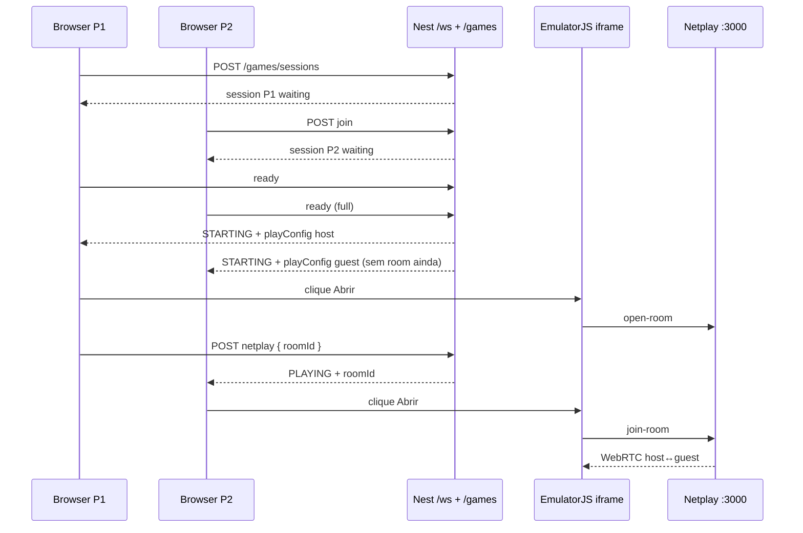

# Arcade SNES Netplay Design

**Spec**: `.specs/features/arcade-netplay/spec.md`  
**Status**: Draft

---

## Research (EmulatorJS / Netplay, ago/2026)

### O que o EmulatorJS faz de verdade

Não é o netplay do RetroArch (replay de input, TCP 55435, cada instância emula).

É **WebRTC**:

1. Servidor [EmulatorJS-Netplay](https://github.com/EmulatorJS/EmulatorJS-netplay) (Node + Socket.IO) só faz **sinalização**.
2. O **host** roda o core SNES.
3. Guests recebem **stream de vídeo** e mandam **input** no data channel.
4. Índice do controle = `Object.keys(players).indexOf(playerID)` (`netplayGetUserIndex`). Host entra primeiro → índice 0 → **P1**. Próximo join → **P2**.

Não existe `EJS_playerNumber`. `netplayOpenRoom` gera o `sessionid` com `guid()` internamente. A forma estável de casar com o nosso backend:

1. Nest define P1 = host da GameSession.
2. Só o P1 cria a sala EmulatorJS.
3. P1 devolve o `sessionid` ao Nest.
4. P2+ fazem `netplayJoinRoom(sessionid, …)` com a password da sessão.

Se qualquer cliente pedir um “Request Device” do RetroArch, o modo automático quebra — o EmulatorJS **não expõe** essa API. Não dá para fazer o guest virar P1 sem ele ser o `open-room`.

### Limitações

| Limitação | Impacto |
| --- | --- |
| Netplay experimental (não está estável no 4.2.3; ícone 🌐 pedia debug) | Pin `cdn.emulatorjs.org/latest` e chamar `netplayOpenRoom` / `joinRoom` via iframe |
| SPA: EmulatorJS tem de ir em **iframe** | `public/emulator/play.html` |
| Servidor Netplay sem auth (`origin: *`) | Password aleatória por sessão; `/list` continua público — a password trava o join |
| Host cai | EmulatorJS passa owner ao próximo; P1/P2 pode embaralhar. Encerramos a sessão. |
| STUN/TURN | LAN: STUN Google basta. NAT difícil: TURN (não sobe no compose por padrão; documentado) |
| Gesto do browser | Autoplay do emulador precisa de clique (“Abrir fliperama”) |

### RetroArch nativo

Não usamos. Seria outro binário, outra porta (55435/tcp) e WASM do RA não está no EmulatorJS.

---

## Architecture Overview



O escritório continua dono de: `guestId`, presença `/ws`, SQLite, Docker Compose, proxy Vite/Nginx.

---

## Code Reuse

| Existing | How |
| --- | --- |
| `guestId` + `sanitizeGuestId` | Identidade |
| `OfficeRepository` / SQLite | Novas tabelas no mesmo `office.db` |
| `PresenceService.broadcastAll` | Lobby ao vivo (`type: 'game'`) |
| TV panel + `E` no móvel | Fliperama `use: 'play'` |
| `docker-compose.yml` | Serviço `netplay` extra |
| Vite proxy `/ws` `/voice` `/offices` | + `/games` + Socket.IO |

Não criamos AuthModule.

---

## Data

`game_sessions` + `game_session_players` no SQLite. Uma sessão **ativa** (`waiting|ready|starting|playing`) por office slug.

Catálogo em `shared/game-catalog.ts`. ROM em `GAMES_ROM_DIR` (default `server/data/roms/`). Jogo só aparece se o ficheiro existir.

---

## Player mapping (authoritative)

```
guestId → GameSessionPlayer.playerNumber (Nest)
        → host abre a sala EmulatorJS
        → netplayGetUserIndex 0 = P1, 1 = P2
        → simulateInput(player, …) no core snes9x
```

Regra: **quem cria a sessão Nest é sempre o host EmulatorJS**. Não invertível sem patch do EmulatorJS.

---

## Rede / Docker / Nginx

| Peça | Porta | Protocolo |
| --- | --- | --- |
| Nest | 8787 | HTTP + WS presença |
| Netplay | 3000 | HTTP `/list` + Socket.IO (TCP) |
| WebRTC | dinâmico | UDP via STUN; TURN se NAT ruim |
| LiveKit | inalterado | |

Produção: `wss://office/games` no Nest; `https://netplay.exemplo.com` (WebSocket) para o Socket.IO. ICE: STUN público; TURN opcional (`NETPLAY_ICE_JSON`).
