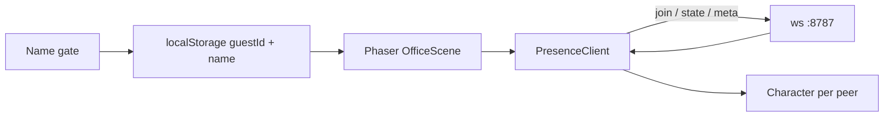

# Presence Design

**Spec**: `.specs/features/presence/spec.md`
**Status**: Approved (path locked in context.md)

---

## Architecture Overview

One Node WebSocket process holds a single in-memory room. The Vite dev server proxies `/ws`. The Phaser client already draws many `Character` instances (player + NPCs); remote peers are the same class, driven by network poses instead of WASD.



---

## Code Reuse Analysis

| Component | Location | How to use |
| --- | --- | --- |
| Character | `src/character/Character.ts` | Snapshot + applyRemote; NPCs already prove multi-body |
| SavedAvatar | `src/character/appearance.ts` | Extend with `guestId`; migrate v6 |
| Hud | `src/ui/hud.ts` | Name/appearance callbacks already persist; add presence pill |
| HTML panels | `index.html` / `src/styles.css` | Same overlay language for the gate |

---

## Components

### Identity (`appearance.ts` + `src/ui/gate.ts`)

- Mint `guestId` with `crypto.randomUUID()`
- `needsName()` is true for empty / `Você`
- Gate is HTML, shown before `new Phaser.Game`

### Protocol (`shared/protocol.ts`)

Tagged JSON. Client: `join`, `state`, `meta`. Server: `welcome`, `join`, `leave`, `state`, `meta`.

### Server (`server/index.ts`)

In-memory `Map<guestId, Connection>`. Broadcast to everyone except sender. Duplicate `guestId` closes the old socket.

### PresenceClient (`src/net/presence.ts`)

Connects after the scene is ready. Reconnects with backoff. Never throws into the game loop.

### OfficeScene

Owns `Map<guestId, Character>`, sends pose ~12 Hz and immediately on sit/wave/stand/meta, lerps remote positions.

---

## Data Models

```typescript
type SavedAvatar = {
  guestId: string
  name: string
  appearance: Appearance
}

type Pose = {
  x: number
  y: number
  facing: Direction
  action: Action
  step: number
  depthBias: number
}

type Peer = {
  guestId: string
  name: string
  appearance: Appearance
  pose: Pose
}
```

Storage key: `meeting-office-avatar-v7` (migrate v6).

---

## Error Handling Strategy

| Scenario | Handling | User impact |
| --- | --- | --- |
| Server down | Client retries; play continues | Pill: sozinho |
| Bad JSON | Server ignores | None |
| Duplicate tab, same guestId | New tab wins | Old tab drops to sozinho / reconnects as replacement |

---

## Tech Decisions

| Decision | Choice | Rationale |
| --- | --- | --- |
| Transport | NestJS HTTP + `ws` `/ws` | Contas entram no mesmo processo; cliente Phaser não muda |
| Auth | None | Guest id is a claim; good enough until accounts |
| Furniture | Unchanged localStorage | Shared layout is a different feature |
| Tests | `npm run build` | Repo has no test runner yet |
