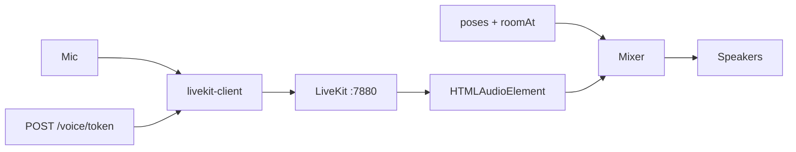

# Voice Design

**Spec**: `.specs/features/voice/spec.md`

## Architecture

Duas tubulações. Presença continua no `/ws`. Áudio vai ao LiveKit (SFU). O Phaser só mistura volume.

## Components

| Piece | Location |
| --- | --- |
| Token | `server/src/voice/` — JWT LiveKit, identity = presence id da aba |
| Mixer | `src/audio/spatial.ts` — gain por distância e `RoomId` |
| Client | `src/net/voice.ts` — Room.connect, mic, attach tracks |
| HUD | `src/ui/voiceHud.ts` |
| Anel | `Character.setSpeaking` / `setMicMuted` |

## Spatial curve

- Mesma `RoomId` (`office`, `meeting`, `hall`, `lounge`, `cafe`): volume 1
- Sala diferente: 0 (outro canal)
- `deaf`: volume 0 via LiveKit `setVolume` (não `HTMLAudioElement.muted` — Safari pausa o elemento e não retoma)

## LiveKit local

`docker compose` serviço `livekit` com `--dev` (key `devkey` / `secret`). Nest usa esses defaults se o env estiver vazio. `LIVEKIT_PUBLIC_URL` é o `wsUrl` devolvido ao browser.

## Error handling

| Caso | Efeito |
| --- | --- |
| SFU down | HUD “voz off”; movimento/chat intactos |
| Mic negado | Fica mudo, ainda ouve os outros |
| Autoplay bloqueado | `room.startAudio()` no primeiro clique |
